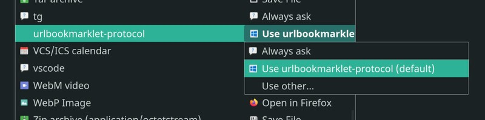
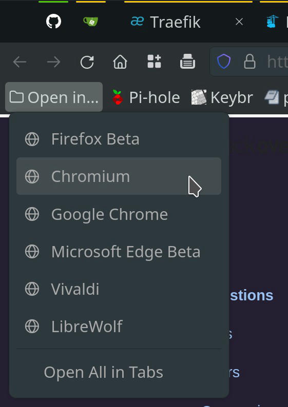
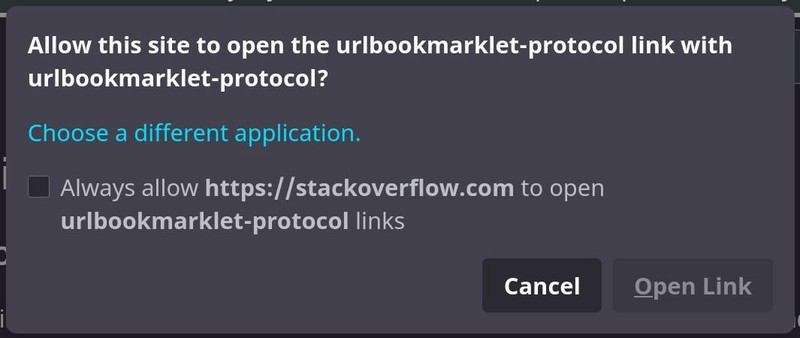

# firefox-open-tab-another-browser
**Add bookmarklets in Firefox to quickly open current tab's URL in another browser.**

Requirements:
- Firefox on Linux
- Python
- another web browser: Chrome, Edge, etc.

## **Setup**

**Clone this repo and place the files on their respective locations as instructed below.**

## 1. python script: `http_url_handler.py`
- edit your browsers absolute paths here
```
$ chmod +x ~/bin/http_url_handler.py
---
browsers = {
    'ffstable': '/usr/bin/firefox',
    'ffbeta': '/usr/bin/firefox-beta',
    'ffdev': '/usr/bin/firefox-developer-edition',
    'gchromium': '/usr/bin/chromium',
    'gchrome': '/usr/bin/google-chrome-stable',
    'msedgebeta': '/usr/bin/microsoft-edge-beta',
    'vivaldi': '/usr/bin/vivaldi-stable',
    'librewolf': '/usr/bin/librewolf',
}
```

## 2. desktop entry file for handling HTTP mimetype
- no need to edit this.
```
$ chmod +x ~/.local/share/applications/http-url-handler.desktop
```

## 3. desktop entry file for the Firefox bookmarklet
- change `<USER>` in Exec line.
```
~/.local/share/applications/urlbookmarklet-protocol.desktop
---
Exec=/usr/bin/python3 /home/<USER>/bin/http_url_handler.py %u
```

## 4. set http and https mimetype handler to `http-url-handler.desktop`
```
$ xdg-mime default http-url-handler.desktop x-scheme-handler/http
$ xdg-mime default http-url-handler.desktop x-scheme-handler/https

OR manually edit [Default Applications] in ~/.config/mimeapps.list
---
x-scheme-handler/http=http-url-handler.desktop
x-scheme-handler/https=http-url-handler.desktop
```

```
$ update-desktop-database ~/.local/share/applications/

VERIFY:
$ xdg-mime query default x-scheme-handler/http
http-url-handler.desktop
$ xdg-mime query default x-scheme-handler/https
http-url-handler.desktop

TEST:
$ xdg-open https://en.wikipedia.org/_______ffbeta
```

## 5. Add bookmarklets to Firefox: import `ff_bookmarklets.html`
- move folder to Bookmarks Toolbar for easy access
```
javascript:location.href='urlbookmarklet-protocol://'+location.href+'_______ffstable
javascript:location.href='urlbookmarklet-protocol://'+location.href+'_______ffbeta'
javascript:location.href='urlbookmarklet-protocol://'+location.href+'_______ffdev'
javascript:location.href='urlbookmarklet-protocol://'+location.href+'_______gchromium'
javascript:location.href='urlbookmarklet-protocol://'+location.href+'_______gchrome'
javascript:location.href='urlbookmarklet-protocol://'+location.href+'_______msedgebeta'
javascript:location.href='urlbookmarklet-protocol://'+location.href+'_______vivaldi'
javascript:location.href='urlbookmarklet-protocol://'+location.href+'_______librewolf'
```

## 6. Set custom protocol action in Firefox (might need browser restart)
- if bookmarklets don't work in the next step, try setting this to 'Always ask' first.



## 7. Try the bookmarklets!



To bypass the "Open Link" prompt, you can use Tridactyl.



---
## optional: install Tridactyl - Firefox add-on
https://github.com/tridactyl/tridactyl/
- this will let you bind keyboard shortcuts to trigger the bookmarklets instantly.

```
sample Tridactyl key bindings:
---
bind =beta composite js 'urlbookmarklet-protocol://'+location.href+'_______ffbeta' | open
bind =dev composite js 'urlbookmarklet-protocol://'+location.href+'_______ffdev' | open
bind =um composite js 'urlbookmarklet-protocol://'+location.href+'_______gchromium' | open
bind =gc composite js 'urlbookmarklet-protocol://'+location.href+'_______gchrome' | open
bind =edge composite js 'urlbookmarklet-protocol://'+location.href+'_______msedgebeta' | open
bind =vi composite js 'urlbookmarklet-protocol://'+location.href+'_______vivaldi' | open
bind =wolf composite js 'urlbookmarklet-protocol://'+location.href+'_______librewolf' | open
```

That's it! 🥳
